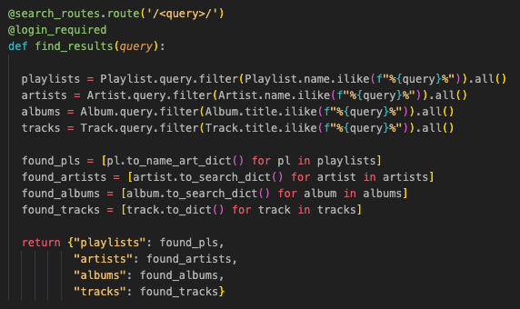

<!-- PROJECT LOGO -->
<br />
<p align="center">
  <a href="https://github.com/tedjanton/VJDJ">
    
  </a>

  
  <h3 align="center">VjDj</h3>

  <p align="center">
VjDj (Video Jockey, Disc Jockey) is a Spotify clone with music videos...because why not have both in the same place? Pick a song to play, then make a playlist, add songs to it, edit it (with a drag and drop!), follow others' playlists, all while listening to tracks without interruptions. Feel like watching the music video for a particular song? Just click the "watch video" button and your wish will be granted.
    <br />
    <a href="https://github.com/tedjanton/VJDJ"><strong>Explore the docs »</strong></a>
    <br />
    <br />
    <a href="https://vjdj.herokuapp.com/">View Demo</a>
    ·
    <a href="https://github.com/tedjanton/VJDJ/issues">Report Bug</a>
    ·
    <a href="https://github.com/tedjanton/VJDJ/issues">Request Feature</a>
  </p>
</p>


<!-- TABLE OF CONTENTS -->
<details open="open">
  <summary><h2 style="display: inline-block">Table of Contents</h2></summary>
  <ol>
    <li>
      <a href="#about-the-project">About The Project</a>
      <ul>
        <li><a href="#overall-structure">Overall Structure</a>
        <ul>
          <li><a href="#back-end">Back End</a>
          <li><a href="#front-end">Front End</a>
          <li><a href="#built-with">Built With</a>
        </ul>
        <li><a href="#major-features">Major Features</a>
      </ul>
    </li>
    <li>
      <a href="#getting-started">Getting Started</a>
      <ul>
        <li><a href="#prerequisites">Prerequisites</a></li>
        <li><a href="#installation">Installation</a></li>
      </ul>
    </li>
    <li><a href="#usage">Usage</a></li>
    <li><a href="#obstacles">Obstacles</a></li>
    <ul>
      <li><a href="#drag-and-drop-playlist-editing">Drag and Drop Playlist Editing</a></li>
      <li><a href="#dynamic-searching">Dynamic Searching</a></li>
    </ul>
    <li><a href="#roadmap">Roadmap</a></li>
    <li><a href="#contributing">Contributing</a></li>
    <li><a href="#license">License</a></li>
    <li><a href="#contact">Contact</a></li>
    <li><a href="#acknowledgements">Acknowledgements</a></li>
  </ol>
</details>


<!-- ABOUT THE PROJECT -->
## About The Project
[Click here to view VjDj live on the web!](https://vjdj.herokuapp.com/)
<br>
</br>
<!--  -->


## Overall Structure

### Back End
The app was built using Flask and SQLAlchemy on the back end with a PostgreSQL database. The backend structure is RESTful with AJAX requests that are fullfilled with a JSON API. Model class methods are used to minimize database queries to the backend, assuring speed and reliability.

### Front End
The front end is built with React and Javascript while utilizing Redux architecture, producing a lightning-fast user interface and calling upon dynamically rendered components.  

### Built With

* [Flask](https://flask.palletsprojects.com/en/1.1.x/)
* [Python](https://www.python.org/)
* [SQLAlchemy](https://www.sqlalchemy.org/)
* [Javascript](https://www.javascript.com/)
* [React](https://reactjs.org/)
* [Redux](https://redux.js.org/)
* [Node.js](https://nodejs.org/en/)
* [HTML](https://html.com/)
* [CSS](http://www.css3.info/)

## Major Features
VjDj incorporates a plethora of features, including:
* Fully functioning music player
  * Play a song, playlist, artist, or album
  * Persistant music playing as you navigate the site
  * Skip forward or backward, including from the middle of a playlist
  * Adjust volume
* Playlist actions
  * Create a new playlist
  * Add songs to a playlist that you own from anywhere a song is listed
  * Delete songs from playlists that you own
  * Edit the order of songs in real time without disrupting the music player
  * Delete a playlist
  * Follow other users' playlists
* Music videos
  * Click on a video play button on a song listing to watch the respective music video
  * If a music video doesn't exist for a specific song, the button is disabled
* Browsing and searching
  * Discover songs, artists, and playlists by browsing the library
  * Already have something in mind? Search for it to see live updates as you type

<!-- GETTING STARTED -->
## Getting Started

1. Clone the repo
   ```sh
   git clone https://github.com/tedjanton/VJDJ.git
   ```
2. In the react-app directory, install NPM packages
   ```sh
   npm install
   ```
3. Add a '.env' with your environment variables to the root of your local directory

4. Create a postgreSQL user
    ```sh
    CREATE USERS <<your username>> WITH PASSWORD <<your password>> CREATEDB
    ```
5. In the root of the repo, upgrade your database
    ```sh
    flask db upgrade
    ```
6. Seed your database
    ```sh
    flask seed all


<!-- USAGE EXAMPLES -->
## Usage

### An impactful home page with the site's most popular songs for quick play


### Search dynamically for any available artist, song, playlist, or album while music is playing


### Edit your playlists with a dynamic drag and drop feature


### Discover music by browsing playlists, artists, or albums


### Create new playlists


### Clicking on a video button pauses the music simultaneously with the video modal opening


### Follow playlists you love


<!-- OBSTACLES -->
## Obstacles

### Drag and Drop Playlist Editing
Since I hadn't created a drag and drop feature before, I needed to do a lot of research before starting. The main resource I used was the [HTML Drag and Drop API](https://developer.mozilla.org/en-US/docs/Web/API/HTML_Drag_and_Drop_API) documentation on MDN.


<br>
<b>Drag Start</b>

After clicking on the track you want to drag, the onDragStart function stores the starting position of the track by it's index and updates a local React state object with "active" values.


<br>
<b>Drag Over</b>

In order for the lifted track to be droppable, it must have both "draggable" and "onDragOver" attributes present. Since all tracks are "drop zones", the local state object will update dynamically as a track is hovered over while removing the dragged track from the list of tracks being watched.


<br>
<b>Drop</b>

Finally, when the track is placed, the variables are "deactivate" within the local state object and the drag and drop order is updated to the newly ordered list.


### Dynamic Searching

</br>
First, a controlled input element collects the user's search query, but only dispatches the query to the back end if they have typed more than 2 characters to reduce the number of queries to the PostgreSQL database.


</br>
On the backend, each table is queried for strings or substrings, searching for the user's input and send an object with each table's results in an array back to the front end.



</br>
Once the results are found, the table data arrays are check to determine if they are empty, and if so, a "No results found" message is displayed to the user so that they know to try a different search.


<!-- ROADMAP -->
## Roadmap

See the [open issues](https://github.com/tedjanton/VJDJ/issues) for a list of proposed features (and known issues).


<!-- CONTRIBUTING -->
## Contributing

Contributions are what make the open source community such an amazing place to be learn, inspire, and create. Any contributions you make are **greatly appreciated**.

1. Fork the Project
2. Create your Feature Branch (`git checkout -b feature/AmazingFeature`)
3. Commit your Changes (`git commit -m 'Add some AmazingFeature'`)
4. Push to the Branch (`git push origin feature/AmazingFeature`)
5. Open a Pull Request


<!-- CONTACT -->
## Contact

Email - tedjanton@gmail.com

Project Link: [https://github.com/tedjanton/VJDJ](https://github.com/tedjanton/VJDJ)
